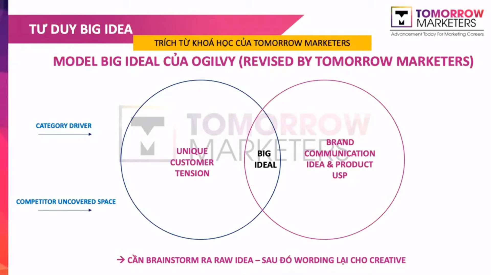
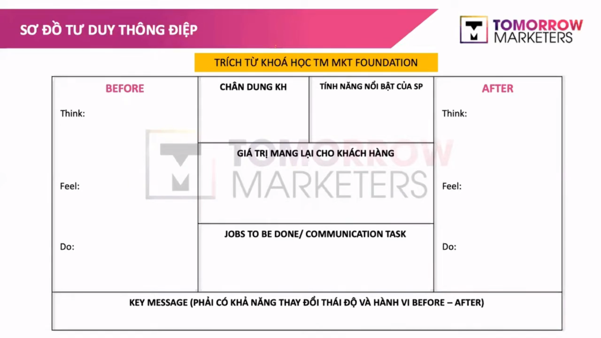
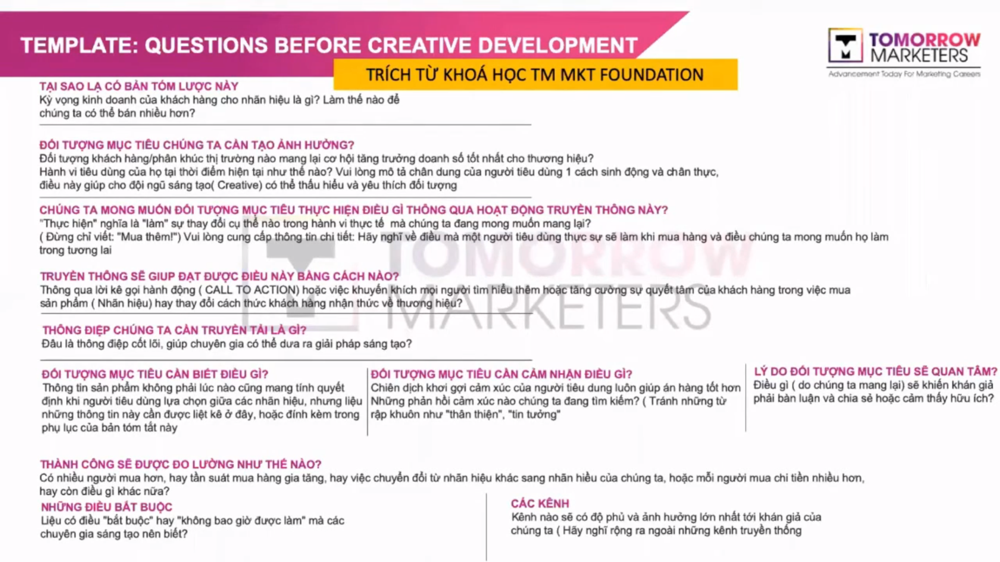

A NOTE FOR THE VIDEO:
# [Webinar "How to win Business & Marketing Case" - UFLL & Young Marketers](https://www.youtube.com/watch?v=og7rok8Tja4&fbclid=IwAR1oRqKHIDPSkWMh5nmY6H3qYZcP3bKyJsqOWF5XNLjOtMklZiXwJpbD3NQ)
click [here](https://www.youtube.com/watch?v=og7rok8Tja4&fbclid=IwAR1oRqKHIDPSkWMh5nmY6H3qYZcP3bKyJsqOWF5XNLjOtMklZiXwJpbD3NQ) to go to the video
Table of contents
<!-- vim-markdown-toc GFM -->

* [Tu duy big idea, brand ntn (0:16)](#tu-duy-big-idea-brand-ntn-016)
        * [Ogilvy big idea model (revised by tomorrow marketer) : cac anh chi tong hop tu nhieu cuon sach](#ogilvy-big-idea-model-revised-by-tomorrow-marketer--cac-anh-chi-tong-hop-tu-nhieu-cuon-sach)
        * [So do tu duy thong diep : brand - agency (2:26)](#so-do-tu-duy-thong-diep--brand---agency-226)
* [Template: Question before creative development (5:55)](#template-question-before-creative-development-555)
* [Chan dung mot nha vo dich ? Q&A with champions (10:00)](#chan-dung-mot-nha-vo-dich--qa-with-champions-1000)
        * [Q: Team ufll da "tiep can" de bai nhu the nao (14:27)](#q-team-ufll-da-tiep-can-de-bai-nhu-the-nao-1427)
        * [Q: Thay doi cuoc song the nao (19:01)](#q-thay-doi-cuoc-song-the-nao-1901)

<!-- vim-markdown-toc -->

## [Tu duy big idea, brand ntn (0:16)](https://youtu.be/og7rok8Tja4?t=16)
### Ogilvy big idea model (revised by tomorrow marketer) : cac anh chi tong hop tu nhieu cuon sach

Big idea = (category driver , competitor uncovered space)=> (unique customer tension, brand communication idea & product usp)
> Can brandstorm ra raw idea - sau do __wording__ lai cho creative
> Thuong thi minh brainstorm se khong ra nhung cau vi mo nghe hay tu dau, phai generate punchline later
> Cac ban phai lam phan marketing research rat la ki de ra communication strategy, tu do creative idea moi bao ham , giai quyet dc nhung van de minh tim ra
### [So do tu duy thong diep : brand - agency (2:26)](https://youtu.be/og7rok8Tja4?t=146)

- Key message ( phai co kha nang thay doi thai do  va hanh vi before - after ) 

## [Template: Question before creative development (5:55)](https://youtu.be/og7rok8Tja4?t=355)

Main idea:
- Tai sao co ban tom luoc nay : ki vong kinh doanh cua khach hang cho nhan hieu la gi, lam the nao de ban nhieu hon
- Doi tuong muc tieu chung ta can anh huong
- Chung ta mong muon doi tuong muc tieu thuc hien dieu gi thong qua hoat dong truyen thong nay
- Truyen thong se giup dat duoc dieu nay bang cach nao
- Thong diep chung ta can truyen tai la gi
- Doi tuong muc tieu can biet dieu gi
- Doi tuong muc tieu can cam nhan dieu gi
- Ly do doi tuong muc tieu se quan tam
- Thanh cong se duoc do luong ntn
- Nhung dieu bat buoc
- Cac kenh
 > Neu ma sau nay di lam agency, cac ban creative khong co ban tom luoc nay thi dung co nhan brief. 
   Con neu lam brand thi nho truoc khi brief cho agency, cung cap cang nhieu thong tin o tren cang giup ich cho ho dua ra nhung solution hop ly nhat.
   Con neu bon em di thi chang han, chia task noi bo hay tu lam chang han, phai co thong tin o phia tren, phan to have, analysis.
   
Phan creative can phai chu trong dieu gi : 
- Thu 1 can ban tom luoc, hieu ve brand, ve sp, nguoi tieu dung, muc tieu , KPI dua ra, 
- Thu 2 la doi tuong nguoi tieu dung nao, anh huong nhu the nao doi voi ho , hanh vi cua ho tai thoi diem nay ra sao, chuyen doi hanh vi nhu the nao : phai thau hieu hanh vi hien tai thi moi chuyen doi hanh vi cua ho dc, toi muon doi tuong nay thuc hien chuyen gi, thi phai rat ro la : doi tuong nay la ai va ho suy nghi nhu the nao, ve ra chan dung do cang chi tiet cang tot, thi khi do creative bon em da hieu ra dc roi, thi se biet duoc la lam sao de ma call to action , de convince ho lam theo nhung action minh dua ra, 

Vay thi thong diep minh can truyen tai la gi, nhung thong diep cot loi ma campaign can dua ra dua tren: 
1. Doi tuong muc tieu can biet dieu gi, ban do can biet sp hay la ban do can biet duoc 1 cai treasure nao ben trong rat la noi troi, 
2. Doi tuong muc tieu can cam nhan gi khi ho doc thong diep do
3. Li do tai sao ho phai care khi ho thay thong diep nay cua minh 
=> Thi tu 3 cai yeu to nay minh moi tao ra dc 1 thong diep ma minh muon dung de truyen tai.

Nghia la de tao ra 1 thong diep thi minh phai biet: 
1. Doi tuong minh can tim do la ai va ho can biet cai gi, 
2. Sau do minh muon ho feeling ntn: feeling tin tuong hay dang yeu qua hay brand nay than thien voi moi truong qua, co nghia la minh phai co functional va emotional, 
3. Thu 3 nua la luon luon co phan noi "why do they care", 

Cuoi cung la lam cai gi cung phai co tinh do luong, vi du nhu la : ok thanh cong cua thang nay, nguoi ta se do luong bang cai gi, vi du nhu co bao nhieu nguoi mua, bao nhieu like share comment: do la tuy vao objective, thi minh se xac dinh dc KPI o day. 

> Nho nha, khi ma minh lam creative, dung bao gio nghi la toi chi sang tao y tuong, toi k care ve cac __kenh__, nhung minh phai nho la ngay nay voi su dich chuyen cua cong nghe, moi nguoi co the tiep can duoc rat nhieu kenh khac nhau, y tuong cua minh no phai duoc consider tren cai kenh ma no hieu qua nhat, thi cai creative do cua minh phai dung format, phu hop, nen khi minh lam 1 cai y tuong cung phai luon luon remind trong dau la __key channel__ ma minh mot phat trien cai y tuong sang tao nay no se o dau, thi minh se co nhung _material, format_ phu hop nhat 

## [Chan dung mot nha vo dich ? Q&A with champions (10:00)](https://youtu.be/og7rok8Tja4?t=600)
Miscellanous:
De nhung nam truoc yeu cau : _dinh vi, phat trien ke hoach dai han cho Brand_
Sang tao => khong nhat thiet
Young marketer elite :  phat trien mot san pham moi, tai dinh vi hinh anh cua xmen - dan ong dich thuc, hieu dung ve marketing
### [Q: Team ufll da "tiep can" de bai nhu the nao (14:27)](https://youtu.be/og7rok8Tja4?t=851)
=> Understanding of brand & challenge
1. tim __brandbook__  cua brand :  __understand__ the brand 
2. hieu ve business challenge : tranh sai huong
3. target audience
4. big idea, new campaign
5. plan
> "hieu brand rat quan trong"
- ngoai case cho san, co can lam them desk research khong? desk research va nhung loai report chung ta can doc de lay duoc Data huu ich?

### [Q: Thay doi cuoc song the nao (19:01)](https://youtu.be/og7rok8Tja4?t=1141)
1. lam marketing co purpose hon, dem lai value gi do cho audience cua minh

