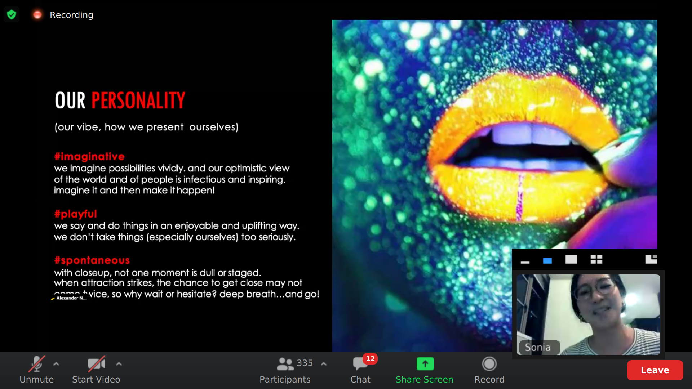
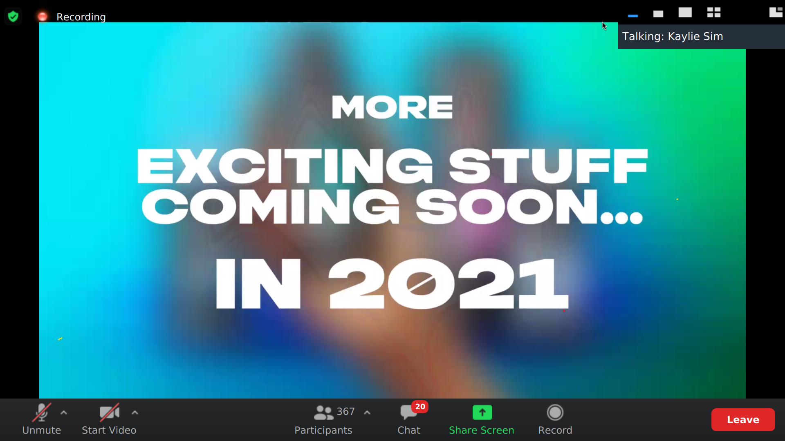

#webinar Unlock UEFLL challenge

#close up an intro sonia
-let's start here: oral care was all about white pastes and white lab coats, until 2 unlilvel scientist
- closeup still disrupts the category
- like a warning we cam in bright red
- & talked about closeness & fressness : brand identity
- with out __bold__ flavours, __vibrant__ colours, and our commitmntent to making oral care more __thrilling__
## our values(what we hold close to our hearts)

- progress: pursuing the most confident, most attracitve, and happiest versions of yourself.

## our personality (our vibe, how we present ourselves)

## we've zigged ever since, while every other toothpaste has zagged.."
while everypone went with cavieiss mums, and dentists - we focuesed on the youth and what really mattered to them; the thrill, and excitement

## what is close up main goal?
will become the #1 oral care __youth__ and __confidence__ icon
## brand positioning in vietnam?
value of love and attraction
- brand value : 
- trang rang hoi tho thom mat: target customer : cac ban tre muon sat lai gan nhau hon
- break all the barrier, khong ngai tuoi tac, vung mien
- content ve emotional , purposeful khong bi gioi han.

#Axe : comms best practices
- 2 campain in south east asia

the attraction is minefiled- today, more than ever
65% of young guys dont feel confident when it comes to f2f
-gender fluid identity: 50% of gen z know someone who use non-binary pronouns

- this had led to a dating crisis
- axe to tell a cohesive story that guides them to her/him: the problem, solution. payoff

- pocket perfume
## summary:
axe cung di theo attraction game, close up rang mieng, axe di theo mui huong, su tu tin, axe thuc day tu ... mat me, 2 space : hoat dong the chat, hoat dong emotional,

challenge talking to the youth in vietnam market:
in communication : changing, 

lgbt, 

# phan 2 :
case competition: can phai biet cuoc thi do dang tim kiem dieu gi o cac thi sinh

- case with purpose

vong 2 1 brand bi mat
top 15 tu moi nhan hang
maximun 30 slide gom phu luc, tips la lam ngan, dung lam dai
hieu functional cua product cung rat quan trong
emotional ko quen functional
lam insight di theo model nao: hoi moi nguoi xung quanh, ban than minh,
deployment plan: dung qua chi tiet, gianh toan bo khong gian de noi big idea, insight.
insight vs observation
youtube search ufll

miscellaneous

